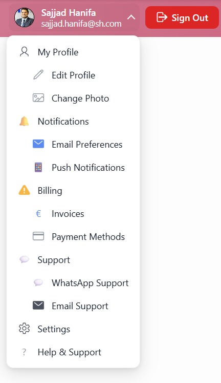
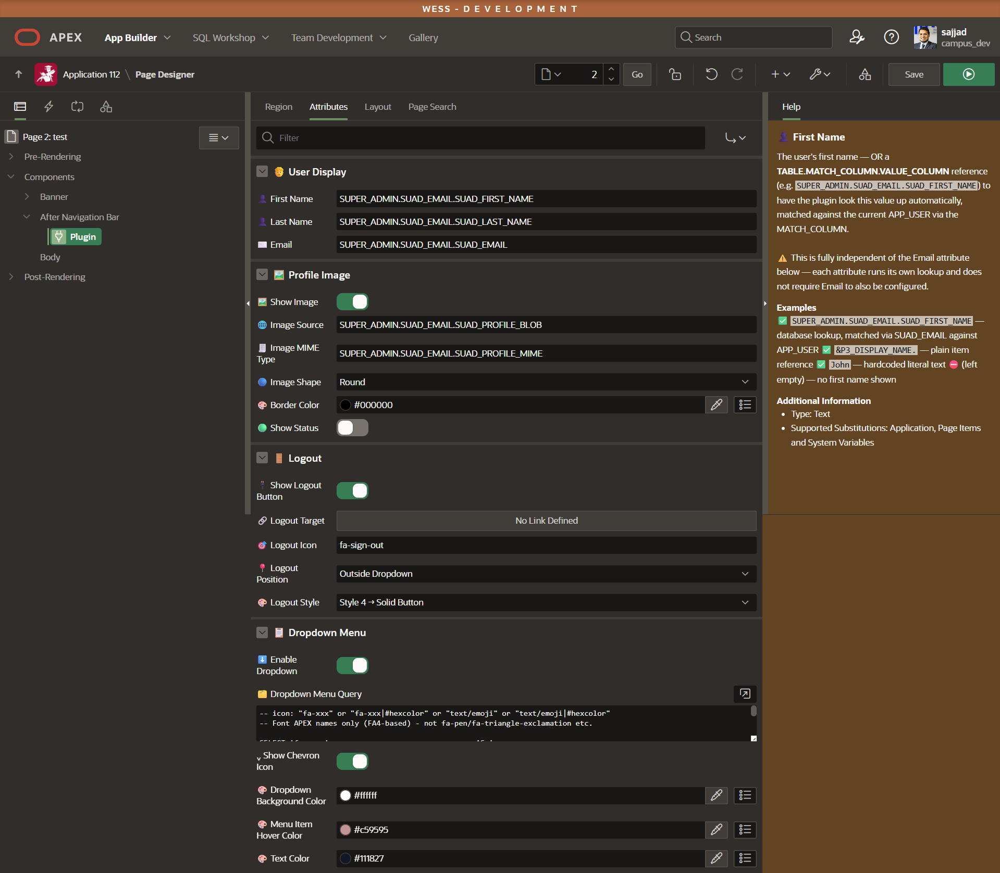
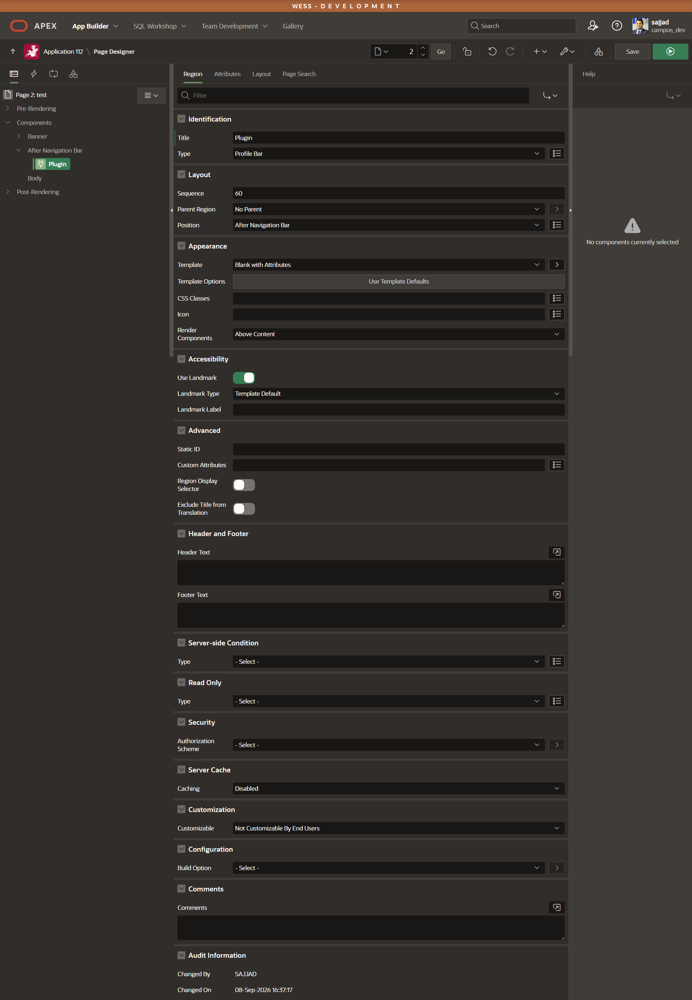
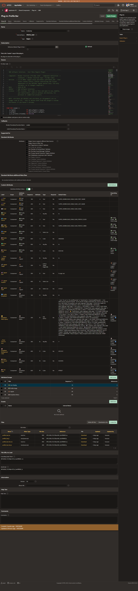
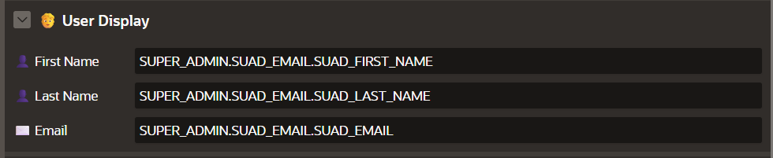
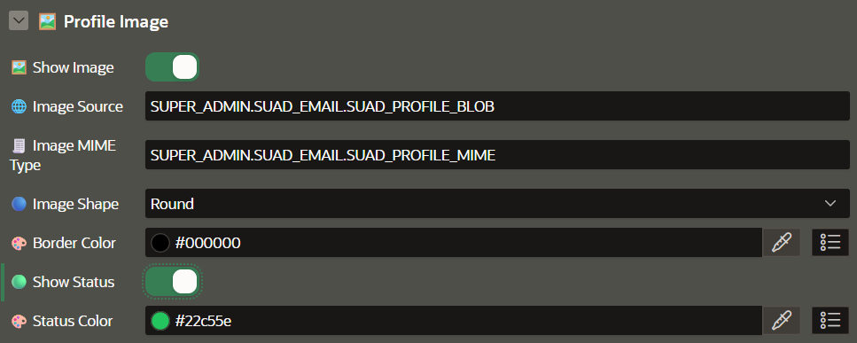
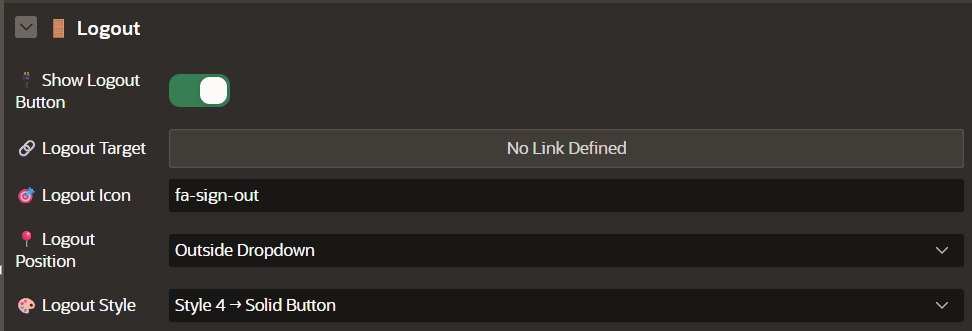
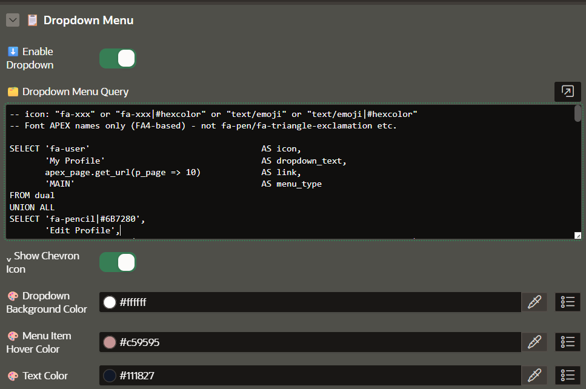

# Profile Bar — Oracle APEX Region Plugin


Turns the Oracle APEX navigation bar into a complete user area: avatar with online status, name and e-mail, a logout button in four styles, and a multi-level dropdown menu built from a plain four-column SQL query — no Navigation Bar List, no Page 0 CSS, no Dynamic Content region.



---

## ✨ Features

<table border="0">
<tr>
<td width="65%" valign="top">

- 🖼️ **Avatar straight from the database** — point *Image Source* at a `BLOB` column with a `TABLE.MATCH_COLUMN.VALUE_COLUMN` reference and the plugin embeds it as Base64; no `apex_util.get_blob_file` call, no extra page, no ORDS handler
- 🔤 **Initials fallback** — no image, no matching row, or an image over 300 KB? The plugin draws the user's initials instead of failing the page
- 🔵 **Three avatar shapes** — round, square or rounded, with an optional border color
- 🟢 **Online status dot** — a colored dot on the avatar corner, color freely configurable
- 👤 **Independent lookups** — First Name, Last Name, E-Mail and Image each run their *own* lookup against `APP_USER`; configure only the ones you need, mix database references, item references (`&P3_EMAIL.`) and literal text freely
- 🗂️ **Multi-level dropdown from SQL** — one query returning `icon, text, link, menu_type`; `MAIN` renders a top-level row, `SUB` an indented one underneath it
- 🎨 **Icon and color per entry** — `fa-user`, `fa-user|#6B7280`, a bare emoji, or `💬|#25D366` — Font APEX classes and plain text/emoji both work
- 🚪 **Logout button, four styles** — icon only, outlined icon, icon + text, or a solid button; placed *outside* the dropdown as a real button or *inside* it as the last menu entry
- 🎨 **Themeable dropdown** — background, hover and text color as color-picker attributes
- ⌨️ **Keyboard and screen reader ready** — arrow keys walk the menu, Escape closes and returns focus, `aria-expanded` / `aria-hidden` stay in sync
- 🔁 **Refresh safe** — `init()` tracks the wrapper id, so a partial page refresh never binds the handlers twice
- 🛡️ **Fails quietly** — a broken menu query renders an empty dropdown instead of an error page, and every value is escaped before it reaches the markup
- 🧩 **No database objects** — your own users table stays exactly as it is; all CSS classes are prefixed `sh-um-` so nothing collides with Universal Theme

</td>
<td width="35%" valign="top">



</td>
</tr>
</table>

---

## 📸 In action

The bar with the dropdown open — main entries in bold, sub-entries indented, each with its own icon and color, and the solid *Sign Out* button next to it:


Placed as a region in the **After Navigation Bar** position, template *Blank with Attributes*:



The plugin definition with all 21 configuration attributes in four groups:



---

## 🚀 Quick start

1. Download [`region_type_plugin_profile_bar.sql`](region_type_plugin_profile_bar.sql)
2. In your app: **App Builder → Import** → select the file → Type *"Plug-In"* → **Next → Install**
   (or run it with SQLcl/SQL\*Plus connected as the application's parsing schema)
3. Confirm it appears under **Shared Components → Plug-ins → Profile Bar**
4. Create a region on the **global page (Page 0)**, set **Position** to *After Navigation Bar* and **Template** to *Blank with Attributes*
5. Set its **Type** to **Profile Bar** and point *First Name* / *E-Mail* / *Image Source* at your own users table

Nothing has to be uploaded from `src/` — the CSS and JS ship inside the plug-in export as plugin files.

---

## ⚙️ Attributes

21 attributes in four groups, in Page Designer order.

### 🧑 User Display



| # | Attribute | Type | Default | Description |
|---|---|---|---|---|
| 6 | 👤 First Name | Text | `SUPER_ADMIN.SUAD_EMAIL.SUAD_FIRST_NAME` | A literal, an item reference, or a `TABLE.MATCH_COLUMN.VALUE_COLUMN` lookup matched against `APP_USER`. Empty → no first name shown |
| 22 | 👤 Last Name | Text | `SUPER_ADMIN.SUAD_EMAIL.SUAD_LAST_NAME` | Same three forms as First Name; its own independent lookup |
| 7 | ✉️ E-Mail | Text | `SUPER_ADMIN.SUAD_EMAIL.SUAD_EMAIL` | Same three forms. If a database lookup finds no row, `APP_USER` is shown instead — never blank |

### 🖼️ Profile Image



| # | Attribute | Type | Default | Description |
|---|---|---|---|---|
| 1 | 🖼️ Show Image | Checkbox | `N` | Master switch. With `N`, every attribute below except *Show Status* is ignored |
| 2 | 🌐 Image Source | Text · required | `SUPER_ADMIN.SUAD_EMAIL.SUAD_PROFILE_BLOB` | A literal image URL, an item reference, or a `TABLE.MATCH_COLUMN.VALUE_COLUMN` BLOB reference embedded as Base64. Over 300 KB → initials (depends on *Show Image = Y*) |
| 23 | 🧾 Image MIME Type | Text · required | `SUPER_ADMIN.SUAD_EMAIL.SUAD_PROFILE_MIME` | MIME column for the BLOB; defaults to `image/png` when unresolved (depends on *Show Image = Y*) |
| 3 | 🔵 Image Shape | Select List | `Round` | `Round` · `Square` · `Rounded` (depends on *Show Image = Y*) |
| 5 | 🎨 Border Color | Color | `#000000` | `#RRGGBB` or `#RGB`; anything else is ignored and no border is drawn (depends on *Show Image = Y*) |
| 8 | 🟢 Show Status | Checkbox | `N` | Small dot on the avatar's bottom-right corner |
| 9 | 🎨 Status Color | Color | `#22C55E` | Color of that dot (depends on *Show Status = Y*) |

### 🚪 Logout



| # | Attribute | Type | Default | Description |
|---|---|---|---|---|
| 10 | 🔌 Show Logout Button | Checkbox | `N` | Master switch for the whole group |
| 11 | 🔗 Logout Target | Link | – | Any page or URL, e.g. `&LOGOUT_URL.` (depends on *Show Logout Button = Y*) |
| 12 | 🎯 Logout Icon | Text | `fa-sign-out` | Font APEX class (FA4 names) or plain text/emoji (depends on *Show Logout Button = Y*) |
| 13 | 📍 Logout Position | Select List | `Outside Dropdown` | `Outside Dropdown` — a standalone button next to the bar · `Inside Dropdown Menu` — the last entry in the menu (depends on *Show Logout Button = Y*) |
| 24 | 🎨 Logout Style | Select List · required | `Style 1 → Icon Only` | `Style 1 → Icon Only` · `Style 2 → Icon Outlined` · `Style 3 → Icon + Text` · `Style 4 → Solid Button`. CSS-only variants (depends on *Logout Position = Outside Dropdown*) |

### 📋 Dropdown Menu



| # | Attribute | Type | Default | Description |
|---|---|---|---|---|
| 14 | ⬇️ Enable Dropdown | Checkbox | `N` | Master switch for the whole group |
| 15 | 🗂️ Dropdown Menu Query | SQL | a 14-entry sample menu | Exactly four columns: `icon, text, link, menu_type`. Empty → built-in default menu; a runtime error → empty dropdown, never a broken page (depends on *Enable Dropdown = Y*) |
| 16 | ⌄ Show Chevron Icon | Checkbox | `Y` | The little arrow next to the avatar (depends on *Enable Dropdown = Y*) |
| 17 | 🎨 Dropdown Background Color | Color | `#FFFFFF` | Panel background (depends on *Enable Dropdown = Y*) |
| 18 | 🎨 Menu Item Hover Color | Color | `#c59595` | Row hover color (depends on *Enable Dropdown = Y*) |
| 19 | 🎨 Text Color | Color | `#111827` | Menu text color (depends on *Enable Dropdown = Y*) |

> ℹ️ Attributes 20 (*Width*) and 21 (*Alignment*) are no longer read since v1.1.0 — the dropdown sizes itself from its content. They can be deleted from the plug-in's custom attributes.

---

## 💡 Usage examples

**The value formats every text attribute understands**

```
SUPER_ADMIN.SUAD_EMAIL.SUAD_FIRST_NAME   -- database lookup: TABLE.MATCH_COLUMN.VALUE_COLUMN,
                                         -- matched against APP_USER via MATCH_COLUMN
&P3_DISPLAY_NAME.                        -- item reference
John                                     -- literal text
```

Each attribute runs its own lookup — configuring *E-Mail* is not a prerequisite for *First Name*, *Image Source* or anything else.

**Dropdown menu query — four columns, in this order**

```sql
-- icon: "fa-xxx" or "fa-xxx|#hexcolor" or "text/emoji" or "text/emoji|#hexcolor"
-- Font APEX names only (FA4-based) - not fa-pen/fa-triangle-exclamation etc.

SELECT 'fa-user'                                  AS icon,
       'My Profile'                               AS dropdown_text,
       apex_page.get_url(p_page => 10)            AS link,
       'MAIN'                                     AS menu_type
FROM dual
UNION ALL
SELECT 'fa-pencil|#6B7280',
       'Edit Profile',
       apex_page.get_url(p_page => 10, p_items => 'P10_MODE', p_values => 'EDIT'),
       'SUB'
FROM dual
UNION ALL
SELECT 'fa-image|#6B7280',
       'Change Photo',
       apex_page.get_url(p_page => 10, p_items => 'P10_MODE,P10_SECTION', p_values => 'EDIT,PHOTO'),
       'SUB'
FROM dual
UNION ALL
SELECT '🔔',
       'Notifications',
       apex_page.get_url(p_page => 11),
       'MAIN'
FROM dual
UNION ALL
SELECT 'fa-envelope|#2563EB',
       'Email Preferences',
       apex_page.get_url(p_page => 11, p_items => 'P11_TAB', p_values => 'EMAIL'),
       'SUB'
FROM dual
UNION ALL
SELECT '📱|#22C55E',
       'Push Notifications',
       apex_page.get_url(p_page => 11, p_items => 'P11_TAB', p_values => 'PUSH'),
       'SUB'
FROM dual
UNION ALL
SELECT 'fa-exclamation-triangle|#F59E0B',
       'Billing',
       apex_page.get_url(p_page => 50),
       'MAIN'
FROM dual
UNION ALL
SELECT '€|#2563EB',
       'Invoices',
       apex_page.get_url(p_page => 50, p_items => 'P50_TAB', p_values => 'INVOICES'),
       'SUB'
FROM dual
UNION ALL
SELECT 'fa-credit-card|#6B7280',
       'Payment Methods',
       apex_page.get_url(p_page => 50, p_items => 'P50_TAB', p_values => 'PAYMENT'),
       'SUB'
FROM dual
UNION ALL
SELECT '💬',
       'Support',
       apex_page.get_url(p_page => 60),
       'MAIN'
FROM dual
UNION ALL
SELECT '💬|#25D366',
       'WhatsApp Support',
       'https://wa.me/491234567890',
       'SUB'
FROM dual
UNION ALL
SELECT 'fa-envelope',
       'Email Support',
       'mailto:support@weisse-elfen-campus.de',
       'SUB'
FROM dual
UNION ALL
SELECT 'fa-gear',
       'Settings',
       apex_page.get_url(p_page => 900),
       'MAIN'
FROM dual
UNION ALL
SELECT '?|#6B7280',
       'Help & Support',
       'https://support.weisse-elfen-campus.de',
       'MAIN'
FROM dual
```

`MAIN` renders a top-level row, `SUB` an indented row underneath the `MAIN` row above it. Order the query the way the menu should read — there is no sequence column.

**Bar without a dropdown**

Leave *Enable Dropdown* off and switch *Show Logout Button* on with *Logout Position = Outside Dropdown*. The region then renders just the avatar block and the logout button — the usual setup for a slim admin bar.

---

## 🔒 Security note

Every value coming from your attributes and your menu query is escaped before it is written to the page (the plug-in runs with `Escape Mode = HTML`), and the avatar is embedded as a Base64 data URI rather than exposed through a public download URL. The lookups run in the application's parsing schema and always match on the current `APP_USER`, so the region cannot render another user's profile. Authorization still belongs on the target pages — hiding a menu entry is not access control.

---

## 📋 Requirements

| | |
|---|---|
| Oracle APEX | 23.2 or later |
| Theme | Universal Theme |
| Database objects | None — your own users table is enough |
| Supported components | Regions; intended for the *After Navigation Bar* position on Page 0 |
| Icon fonts | Font APEX (FA4-based class names), shipped with Universal Theme |
| Image size limit | 300 KB per avatar BLOB, larger images fall back to initials |

---

## 📁 Repository structure

| Path | Contents |
|------|----------|
| `region_type_plugin_profile_bar.sql` | APEX plug-in export, ready to import |
| `plsql/` | Render function in readable form |
| `src/` | Stylesheet and client-side behavior (source + minified) |
| `screenshots/` | Images used in this documentation |

The files under `src/` are the same code that is embedded in the plug-in export, kept separately so changes stay readable and reviewable in version control.

| Component | Version |
|-----------|---------|
| `render_profile_bar.sql` | 1.2.0 |
| `profile_bar.css` | 1.1.0 |
| `profile_bar.js` | — |

---

## 📄 About

| | |
|---|---|
| Author | [Sajjad Hanifa](https://www.linkedin.com/in/sajjad-hanifa/) |
| Vendor | S&H Software Solution |
| Version | 1.2.0 |
| License | [MIT](LICENSE) |
| Blog | [apexnote.de](https://www.apexnote.de/) |
| YouTube | [APEX-NOTE](https://www.youtube.com/@APEX-NOTE) |

### 🙏 Contributors

Thanks to [Hassaan Ahmed Tahir](https://www.linkedin.com/in/hassaan-ahmed-tahir-5a385b2a1/) for contributing to this plug-in.

### 🔗 Related plug-ins

- [Email Validator](https://github.com/Sajjad-786/apex-email-validator) — live e-mail rule validation in a popover, with optional button control.
- [Password Validator](https://github.com/Sajjad-786/apex-password-validator) — live password rule validation, strength meter and one-click generator.

Found a bug or have a suggestion? Open an [issue](https://github.com/Sajjad-786/apex-profile-bar/issues).
